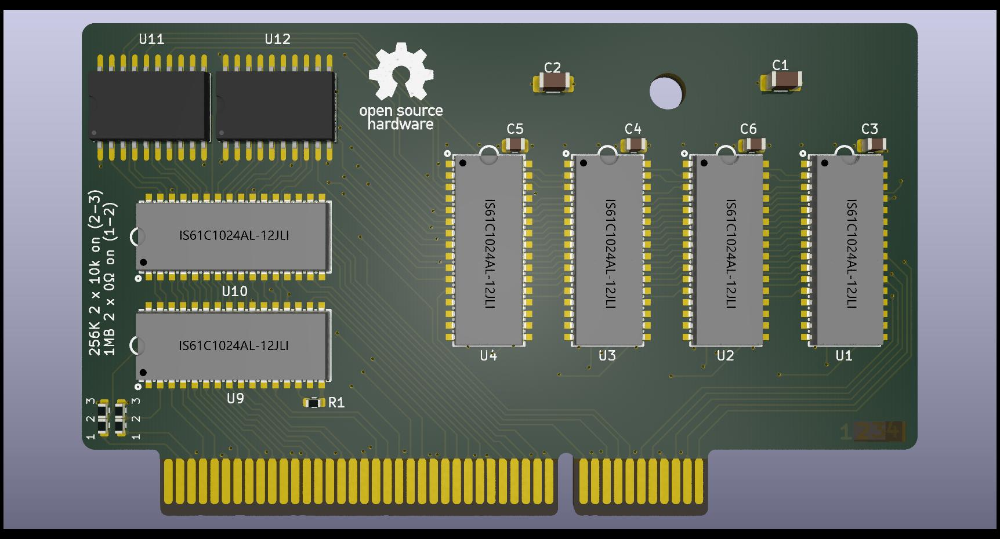

# Compaq 197005-001 Cache Module reproduction
 

Reverse Engineered non standard 256KB/1MB L2 Cache Module for use in:

- [Compaq ProLinea 4/66 (164560-001)](https://theretroweb.com/motherboards/s/compaq-prolinea-4-66)
- [Compaq Presario 833CDS/850/850CDS/860CDS/866 (197023-001)](https://theretroweb.com/motherboards/s/compaq-presario-800)
- [Compaq Presario 700-900 series](https://theretroweb.com/motherboards/s/compaq-presario-700-900-series-486)

# Resources
Original 128KB module [front ](/197005-001_front.jpg?raw=true), [back ](/197005-001_back.jpg?raw=true)

[plugged into Prolinea 4/100](/197005-001_front_2.jpg?raw=true)

-----
This project was possible with help provided by rasz_pl - creator of the - [FIC-486-GAC-2 Cache Module reproduction](https://github.com/raszpl/FIC-486-GAC-2-Cache-Module). Huge thank you for inspiration and taking time to review.

[VL82C481 datasheet](/vl82c481-633364566fabe183309250.pdf)

[VESA VLB slot pinout](/VLB_pins.png) [VESA VLB slot dimensions](/vlb-edge-conn.png)

# Progress report

31/8/2024: Added support for switchable 256KB/1MB

28/8/2024: First version up for testing.

23/8/2024: Project start. Figuring out the pinout and matching to datasheet.
